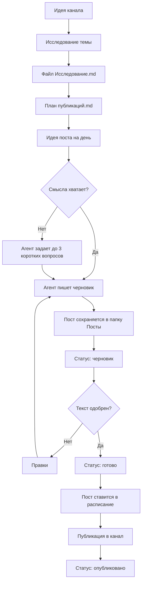

# Телеграм-канал: цепочка работы

Проект нужен, чтобы готовить тексты и план публикаций для телеграм-канала.

Сейчас главный упор — на идеи, посты и расписание. Автоматическая отправка в канал будет добавлена позже.

Пока агент не публикует посты сам. Он готовит тексты, сохраняет их в файлы и помогает вести план.
